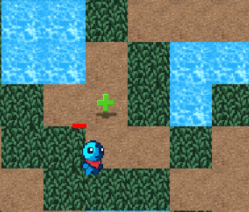
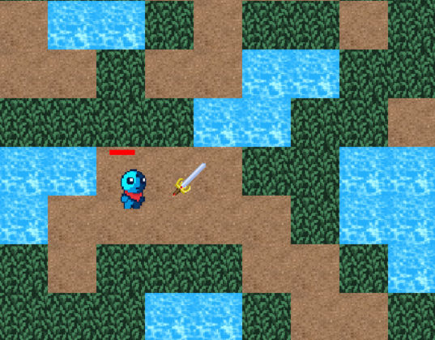

							GAME : THE BEAST

# TỔNG QUAN : 

Đây là một dự án game 2D được phát triển bằng C++ với thư viện SDL2. Dự án được thiết kế để chạy trên Windows với trình biên dịch MinGW.

TRÌNH BIÊN DỊCH : MinGW

THƯ VIỆN :

	SDL2
	SDL2_image
	SDL2_mixer
 

CÔNG CỤ PHÁT TRIỂN : CodeBlocks

# HƯỚNG DẪN CÀI ĐẶT TRÒ CHƠI :

	B1 : 	Tải dự án Game sử dụng GitHub Desktop hoặc lệnh: git clone https://github.com/Duonglt1812/GameProject.git
	B2 :	Copy các file đuôi "dll" vào đường dẫn "bin/Debug"
 	B3 :	Copy tệp assets vào đường dẫn "bin/Debug"
  	B4 : 	Mở file siuuuuuuu.exe trong "bin/Debug" để bắt đầu game

# HƯỚNG DẪN CHƠI : 

- Dùng 4 nút W(trên) - A(trái) - D(phải) - S(dưới) để điều hướng di chuyển nhân vật.
  
- Dùng nút Space để nhân vật tấn công.
  
- Sau khi tiêu diệt 1 enemy, sẽ rơi ra 1 vật phẩm hp, giúp tăng 10 healh :
  
  
  

- Ở Stage 1, có 1 vật phẩm kiếm được spawn, khi nhân vật nhận được vật phẩm này sẽ được nhân đôi damage cho đến cuối trò chơi :
  

Nhân vật sau khi nhặt vật phẩm : 

  *Lưu ý :
  		 - Nhân vật khi không thể đi qua nước(water.png).  Nhân vật khi đi qua cỏ(grass.png) sẽ bị giảm 1 nửa tốc độ. 

# HƯỚNG PHÁT TRIỂN GAME : 

	* Đa dạng, cải tiến về map, đồ họa.
 	* Thêm các màn, phần thưởng, quái và boss.
  	* Xây dựng thêm lối chơi như : thu thập vật phẩm/sinh tồn thay vì chỉ tiêu diệt kẻ địch.
   	* Thêm skill cho nhân vật. 
    * Thêm BXH người chơi chiến thắng nhanh nhất.
      

# NGUỒN : 

- Code có sự học hỏi, tham khảo từ kênh youtube "Let's make game" với series "How to make a Game in C++ & SDL2 from scratch" : https://www.youtube.com/watch?v=QQzAHcojEKg&list=PLhfAbcv9cehhkG7ZQK0nfIGJC_C-wSLrx
  
- Texture nhân vật (player, enemy, boss) : Craftpix.net
  
- Các texture tile map : opengameart.org
  	
- Sound : pixalbay.com
		

MỌI VẤN ĐỀ XIN LIÊN HỆ EMAIL : tungduong12340@gmail.com

CHÚC BẠN CÓ MỘT TRẢI NGHIỆM TUYỆT VỜI ! XIN CHÂN THÀNH CẢM ƠN !
